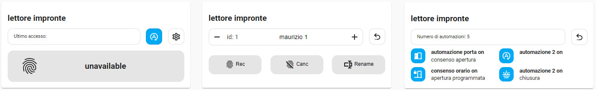

# Lettore Impronte Digitali (ita ver.)

## Description
custom card per la gestione delle impronte digitali


[](https://www.buymeacoffee.com/madmicio)



## hacs Card install
1. add madmicio/lettore-impronte-digitali-ita as custom reposity

2. Find and install `lettore-impronte-digitali-ita` plugin

3. Add a reference  inside your resources config:

  ```yaml
resources:
url: /hacsfiles/lettore-impronte-digitali-ita/figerprint.js
type: module
```


### Manual install

1. Download and copy `figerprint.js` from (https://github.com/madmicio/lettore-impronte-digitali-ita) into your custom components  directory.

2. Add a reference `` from (https://github.com/madmicio/lettore-impronte-digitali-ita) into your custom components  directory.
` inside your resources config:

  ```yaml
  resources:
    - url: /local/"your_directory"/` from (https://github.com/madmicio/lettore-impronte-digitali-ita) into your custom components  directory.

      type: module
  ```
  
## this card needs "saver" integration.
install [SAVER](https://github.com/PiotrMachowski/Home-Assistant-custom-components-Saver) integration

Saver is an extraordinary [Piotr Machowski](https://github.com/PiotrMachowski) project, a simple but very powerful tool.
fills a big gap in Home assistant.


### lovelace essential configuration :
```yaml
type: 'custom:fingerprint-reader'
state_fingerprint: sensor.stato_impronta_2
sensor_record: binary_sensor.acquisendo_impronta
saver: saver.saver
last_id: sensor.ultimo_id_impronta
```

### Main Options
| Name | Type | Default | Supported options | Description |
| -------------- | ----------- | ------------ | ------------------------------------------------ | --------------------------------------------------------------------------------------------------------------------------------------------------------------------------------------------------------------------------------------------------------------------------------------------------------------------------------------------- |
| `type` | string | **Required** | type: 'custom:fingerprint-reader' | Type of the card |
| `state_fingerprint` | string | **Required** | sensor.yourstatesensor | fingerprint sensor state |
| `sensor_record` | string | **Required** | sensor.youreredordersensor  | fingerprint recorder state |
| `saver` | string | **Required** | es: saver.saver  | saver component |
| `last_id` | string | **Option**  | sensor.yourlastidssensor | last id sensor |
| `automation_list` | string |  |  | list of automations to manage in the card|

### automations list options
| Name | Type | Default | Supported options | Description |
| -------------- | ----------- | ------------ | ------------------------------------------------ | --------------------------------------------------------------------------------------------------------------------------------------------------------------------------------------------------------------------------------------------------------------------------------------------------------------------------------------------- |
| `name` | string | friendly name |  | automation custom name |
| `icon` | string | default icon  |  | automation icon, if not indicated a default icon will be displayed and not the automation icon |
| `label` | string | none |  | if not configured the field is empty |

## automations option

this card gives the possibility to enable/disable the automations indicated in the configuration.
if the configuration list contains only one automation, a button will appear which will toggle the automation. if the list contains more than one automation then the same button will show the list of configured automations.
in this case the button will appear active if one of the configured automations is active.

```yaml
type: 'custom:fingerprint-reader'
state_fingerprint: sensor.stato_impronta_2
sensor_record: binary_sensor.acquisendo_impronta
saver: saver.saver
last_id: sensor.ultimo_id_impronta
automation_list:
  - automation: automation.1
    name: automation 1
    label: open
    icon: mdi:door-open
  - automation: automation.2
    name: automation 2
```

for each automation you can configure the name, label and icon.
 - name is an option, and if not specified in config, the button will have the friendly name of the automation
 - icon is an option, if not indicated the button will have a default icon not, if assigned, the automation icon
 - label is an option, if not indicated the field will remain empty
